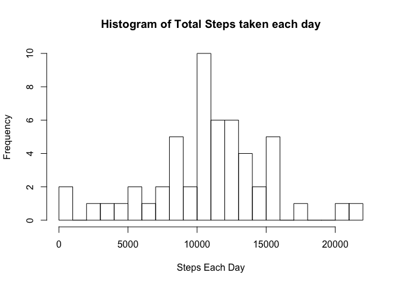
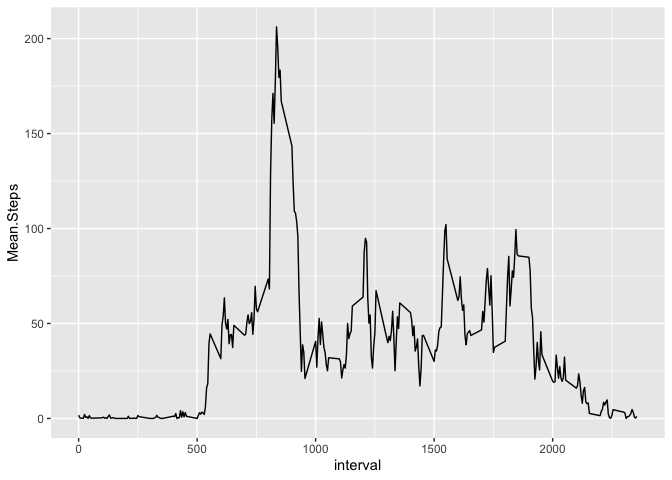
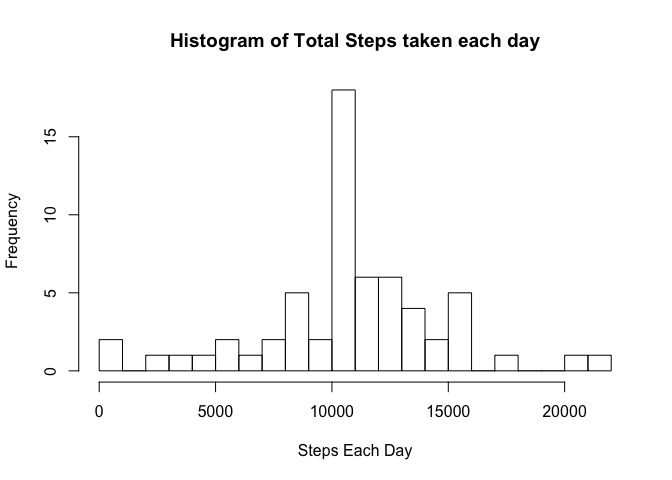
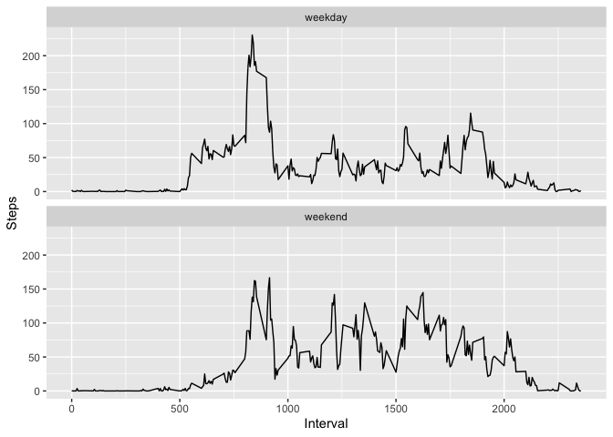

#Activity Monitoring Data
Lakshan

##Loading and preprocessing the data

```r
activity <- read.csv("activity.csv")
head(activity)
```

```
##   steps       date interval
## 1    NA 2012-10-01        0
## 2    NA 2012-10-01        5
## 3    NA 2012-10-01       10
## 4    NA 2012-10-01       15
## 5    NA 2012-10-01       20
## 6    NA 2012-10-01       25
```

##What is mean total number of steps taken per day?

1. Calculate the total number of steps taken per day

```r
stepTotal <- aggregate(activity$steps, by=list(activity$date), FUN = sum)
stepTotal <- na.omit(stepTotal)
names(stepTotal) <- c("Day", "Total.Steps")
head(stepTotal)
```

```
##          Day Total.Steps
## 2 2012-10-02         126
## 3 2012-10-03       11352
## 4 2012-10-04       12116
## 5 2012-10-05       13294
## 6 2012-10-06       15420
## 7 2012-10-07       11015
```

2. Make a histogram of the total number of steps taken each day

```r
hist(stepTotal$Total.Steps, breaks = 30,
     main = "Histogram of Total Steps taken each day",
     xlab="Steps Each Day")
```

<!-- -->

3. Calculate and report the mean and median of the total number of steps taken per day

```r
summary(stepTotal)
```

```
##          Day      Total.Steps   
##  2012-10-02: 1   Min.   :   41  
##  2012-10-03: 1   1st Qu.: 8841  
##  2012-10-04: 1   Median :10765  
##  2012-10-05: 1   Mean   :10766  
##  2012-10-06: 1   3rd Qu.:13294  
##  2012-10-07: 1   Max.   :21194  
##  (Other)   :47
```

```r
mean(stepTotal$Total.Steps)
```

```
## [1] 10766.19
```

```r
median(stepTotal$Total.Steps)
```

```
## [1] 10765
```
The mean is 10766.19 and the median is 10765.

##What is the average daily activity pattern?

1. Make a time series plot (i.e.type = "l") of the 5-minute interval (x-axis) and the average number of steps taken, averaged across all days (y-axis)

```r
act <- na.omit(activity)
act_new <- aggregate(act$steps, by=list(act$interval), FUN = mean)
names(act_new) <- c("interval", "Mean.Steps")
head(act_new)
```

```
##   interval Mean.Steps
## 1        0  1.7169811
## 2        5  0.3396226
## 3       10  0.1320755
## 4       15  0.1509434
## 5       20  0.0754717
## 6       25  2.0943396
```


```r
library(ggplot2)
g <- ggplot(act_new, aes(interval, Mean.Steps)) + geom_line()
g
```

<!-- -->

2. Which 5-minute interval, on average across all the days in the dataset, contains the maximum number of steps?

```r
act_new[act_new$Mean.Steps==max(act_new$Mean.Steps),]
```

```
##     interval Mean.Steps
## 104      835   206.1698
```

##Imputing missing values

1. Calculate and report the total number of missing values in the dataset (i.e. the total number of rows with NAs)

```r
sum(is.na(activity$steps))
```

```
## [1] 2304
```

2. Devise a strategy for filling in all of the missing values in the dataset. The strategy does not need to be sophisticated. For example, you could use the mean/median for that day, or the mean for that 5-minute interval, etc.

Merge and then replace with mean steps for that particular interval

```r
merged <- merge(activity, act_new)
head(merged)
```

```
##   interval steps       date Mean.Steps
## 1        0    NA 2012-10-01   1.716981
## 2        0     0 2012-11-23   1.716981
## 3        0     0 2012-10-28   1.716981
## 4        0     0 2012-11-06   1.716981
## 5        0     0 2012-11-24   1.716981
## 6        0     0 2012-11-15   1.716981
```

3. Create a new dataset that is equal to the original dataset but with the missing data filled in.

```r
merged$replace_steps <- ifelse(is.na(merged$steps), merged$Mean.Steps, merged$steps)
sum(is.na(merged$replace_steps))
```

```
## [1] 0
```

4. Make a histogram of the total number of steps taken each day and Calculate and report the mean and median total number of steps taken per day. Do these values differ from the estimates from the first part of the assignment? What is the impact of imputing missing data on the estimates of the total daily number of steps.


```r
merged_new <- aggregate(merged$replace_steps, by=list(merged$date), FUN = sum)
names(merged_new) <- c("Day", "Total.Steps")

hist(merged_new$Total.Steps, breaks = 30,
     main = "Histogram of Total Steps taken each day",
     xlab="Steps Each Day")
```

<!-- -->


```r
mean(merged_new$Total.Steps)
```

```
## [1] 10766.19
```


```r
median(merged_new$Total.Steps)
```

```
## [1] 10766.19
```
The mean appears to be unaffected by this simple data imputation. The median is smaller.

##Are there differences in activity patterns between weekdays and weekends?

remove unnecessary columns from dataset with the filled-in missing values

```r
merged <- merged[,c("interval", "date", "replace_steps")]
```

1. Create a new factor variable in the dataset with two levels – “weekday” and “weekend” indicating whether a given date is a weekday or weekend day.

```r
merged$day <- weekdays(as.Date(merged$date))
weekend <- c("Saturday", "Sunday")
merged$day <- factor(merged$day %in% weekend, levels=c(FALSE, TRUE), labels=c("weekday", "weekend"))
head(merged)
```

```
##   interval       date replace_steps     day
## 1        0 2012-10-01      1.716981 weekday
## 2        0 2012-11-23      0.000000 weekday
## 3        0 2012-10-28      0.000000 weekend
## 4        0 2012-11-06      0.000000 weekday
## 5        0 2012-11-24      0.000000 weekend
## 6        0 2012-11-15      0.000000 weekday
```


```r
final <- aggregate(merged$replace_steps, by=list(merged$interval, merged$day), FUN = mean)
names(final) <- c("Interval", "Day","Steps")
head(final)
```

```
##   Interval     Day      Steps
## 1        0 weekday 2.25115304
## 2        5 weekday 0.44528302
## 3       10 weekday 0.17316562
## 4       15 weekday 0.19790356
## 5       20 weekday 0.09895178
## 6       25 weekday 1.59035639
```


```r
library(ggplot2)
g <- ggplot(final, aes(Interval,Steps)) + geom_line() + facet_wrap(Day ~., nrow = 2, ncol = 1)
g
```

<!-- -->


